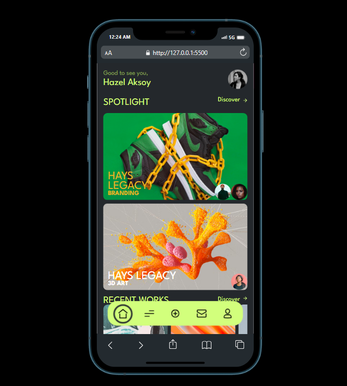
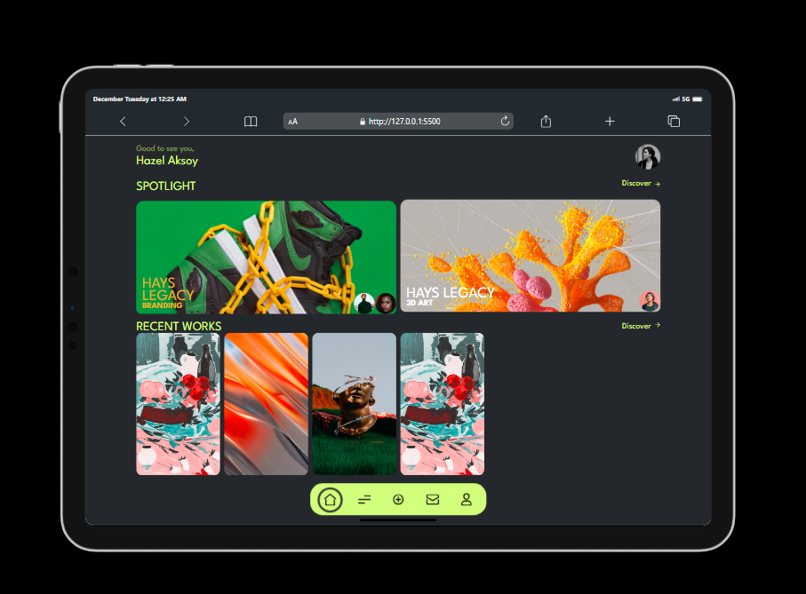

## Dynamic Tabs Project
## Project Overview
This is a project to depict the functionality of dynamic tabs enabling the user to click onto any tab on the web page hence smoothly moving to the next part of the webpage or webapp.

## Tech Stack
This project is built with HTML for markup, CSS for Styling and JavaScript for the functionality.

## Screenshots

